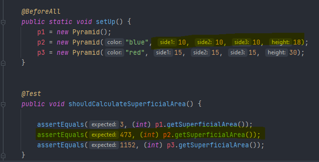

# LAB-INTERFACES

## Parte I - Entendiendo las Interfaces `Shapes`

Circle Class

Circle Test

Cylinder class

Cylinder Test

## Parte II - Implementando Interfaces

### Implementando `GeometricShape2D`

**Clases Triangle y Rectangle**

**Triangle**

**Rectangle**

-------------------------------------------------------------------------------------

**Pruebas Triangle y Rectangle**

**Triangle**

**Rectangle**

----------------------------------------------------------------------------------------

### Implementando `GeometricShape3D`

**Clase Pyramid**

**Clase RectangleSolid**

**TEST DE PYRAMID Y RECTANGLE SOLID**

**PYRAMID**

**RECTANGLESOLID**

**PRUEBA QUE EL AREA Y EL VOLUMEN DE PYRAMID ES CORRECTO**

PRUEBA QUE EL AREA ES CORRECTA:

PRUEBA QUE EL VOLUMEN ES CORRECTO:

**CUBE**

Clase Cube

**TestCube**

-------------------------------------------------------------------------------------

## Parte III - Diseñando Interfaces

## Parte IV - Interfaces Implementando en un contexto

 
## Parte V - Interfaces Integrando

## Parte VI - Interfaces Diseñando en un contexto

This is a push test (ignore)

